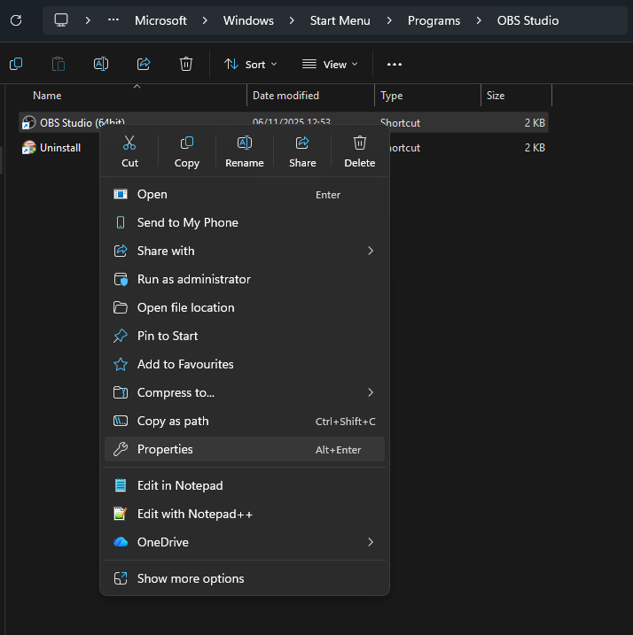
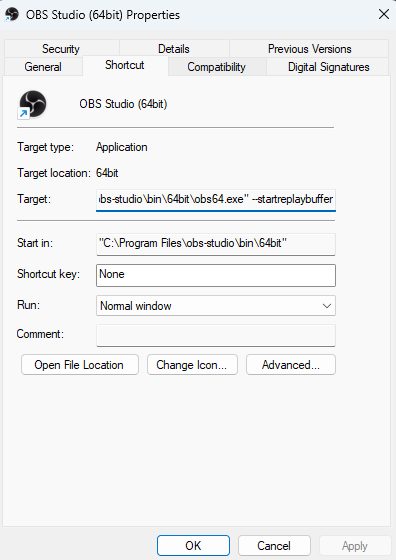

# Automatically starting the Replay Buffer when launching OBS

If the plugin tries to save the Replay Buffer, but it was not started, there will be no video captured!

To avoid this, it is possible to configure OBS to immediately start the buffer so you don't have to remember to start it, once configured.

1. Locate the shortcut used to launch OBS and choose Properties:

2. Add `--startreplaybuffer` at the end of the `Target`

3. [Optional] Move the shortcut to startup applications so OBS is always running on startup