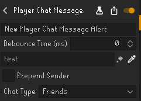
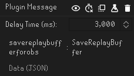

# Plugin Message Integration Guide

It is possible to have other plugins trigger this plugin. Paired with a plugin like [Watchdog](https://runelite.net/plugin-hub/show/watchdog)
this allows very flexible configuration of automatically saving the replay buffer.

This page includes a worked example with Watchdog as a starting point for Plugin Message integration.

> tl;dr send a Plugin Message with `namespace: "savereplaybufferforobs"` and `name/method: "SaveReplayBuffer"`. Data should be omitted.

## Watchdog Worked Example

1. Set up a Watchdog alert as desired. This example test alert can be used and manually triggered by sending a message 'test' in your own friend's chat:

2. Add a Plugin Message notification with `Namespace: "savereplaybufferforobs"` and `Method: "SaveReplayBuffer"`, leave `Data` blank:

> Note that for Plugin Messages, the OBS Replay Buffer is immediately saved. If you want any delays on these advanced trigger, delay in Watchdog

3. Ensure "Save on Plugin Messages (advanced)" is enabled in this plugin's settings.